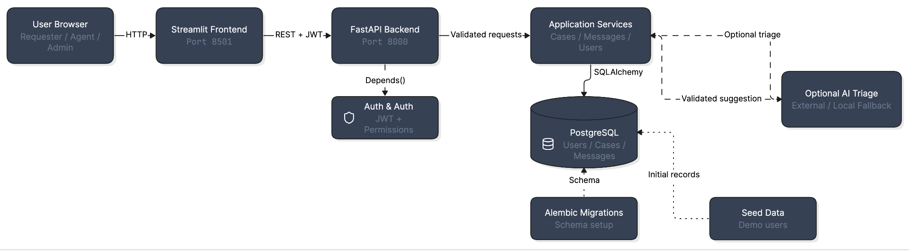
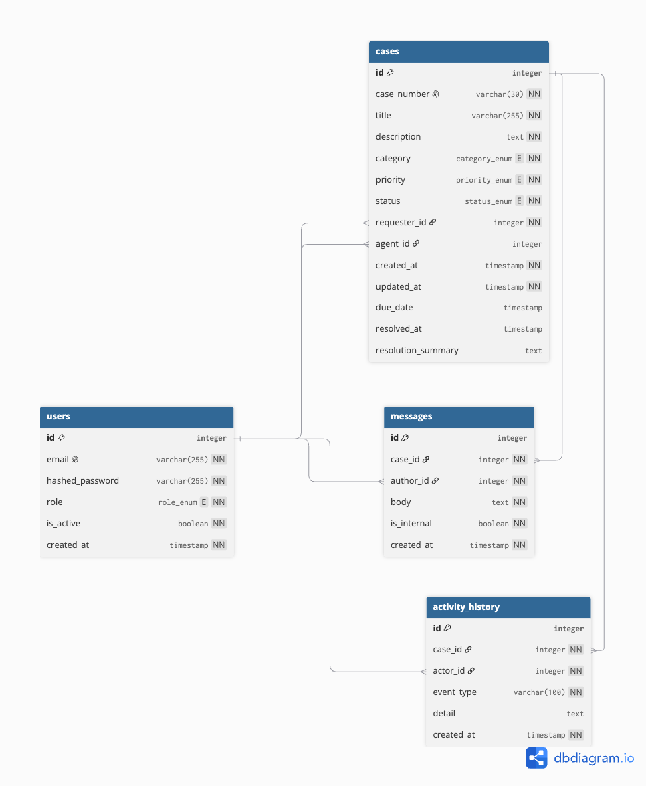

# Support Case Management Application

A browser-based support case management application for requesters, support agents and administrators.

## Features

- JWT authentication and logout.
- Role-based and record-level authorization.
- Requester case creation and case tracking.
- Agent queue for assigned and unassigned cases.
- Case claiming, assignment and reassignment.
- Public replies and private internal notes.
- Case status, category, priority and due-date management.
- Resolution summary validation.
- Seven-day requester reopening workflow.
- Activity history for important case changes.
- Optional AI triage with a local fallback.
- Administrator dashboard, user management and case filters.
- PostgreSQL database, migrations and seed data.

## Technology Stack

- Python 3.12
- FastAPI
- SQLAlchemy
- Alembic
- PostgreSQL 16
- Pydantic
- JWT authentication
- Streamlit
- Docker Compose
- Pytest

## Architecture and Database Diagrams

The diagrams are stored in the `docs/` directory.

### Architecture Diagram



### Entity Relationship Diagram



## Project Structure

```text
support-case-management/
├── backend/
│   ├── app/
│   │   ├── api/
│   │   ├── core/
│   │   ├── models/
│   │   ├── schemas/
│   │   ├── services/
│   │   └── main.py
│   ├── tests/
│   ├── alembic/
│   ├── Dockerfile
│   └── requirements.txt
├── frontend/
│   ├── api_client/
│   ├── pages/
│   ├── streamlit_app.py
│   ├── Dockerfile
│   └── requirements.txt
├── docs/
│   ├── architecture-diagram.png
│   └── er-diagram.png
├── docker-compose.yml
└── README.md
```

## Run with Docker

From the project root, run:

```bash
docker compose up --build
```

This starts:

- PostgreSQL on port `5432`.
- FastAPI on port `8000`.
- Streamlit on port `8501`.

Open the application:

```text
http://localhost:8501
```

Open the FastAPI Swagger documentation:

```text
http://localhost:8000/docs
```

Open the health endpoint:

```text
http://localhost:8000/health
```

Run in the background:

```bash
docker compose up --build -d
```

View service status:

```bash
docker compose ps
```

View logs:

```bash
docker compose logs -f
```

Stop the application:

```bash
docker compose down
```

Reset the local database as well as the containers:

```bash
docker compose down -v
docker compose up --build
```

The `-v` option deletes local PostgreSQL data and should only be used when a clean database reset is intended.

## Local Development

### Backend

From the backend directory:

```bash
cd backend
uvicorn app.main:app --reload
```

The API will be available at:

```text
http://localhost:8000
```

### Frontend

Start the backend first, then run:

```bash
cd frontend
streamlit run streamlit_app.py
```

When Streamlit runs directly on the host machine, use:

```text
API_BASE_URL=http://localhost:8000
```

When Streamlit runs inside Docker Compose, use:

```text
API_BASE_URL=http://api:8000
```

Inside the Compose network, `api` is the backend service name. The browser still opens Streamlit at `http://localhost:8501`.

## Environment Variables

Example backend values:

```text
DATABASE_URL=postgresql://postgres:postgres@db:5432/support_cases
SECRET_KEY=replace-this-with-a-long-random-secret
ACCESS_TOKEN_EXPIRE_MINUTES=60
```

Example frontend value inside Docker Compose:

```text
API_BASE_URL=http://api:8000
```

Optional AI values:

```text
AI_API_KEY=
AI_API_BASE_URL=
AI_MODEL=
```

Do not commit real passwords, secrets, tokens or API keys. Use secure production values outside local development.

## Demo Credentials

These credentials are for local demonstration only:

```text
Requester
Email: requester@example.com
Password: Requester123!

Agent
Email: agent@example.com
Password: Agent123!

Admin
Email: admin@example.com
Password: Admin123!
```

## Role Permissions

### Requester

- Create cases.
- View only cases they created.
- View public replies.
- Send public follow-up replies.
- Reopen a recently resolved case when permitted.
- Cannot view internal notes.
- Cannot manage case fields, users or roles.

### Support Agent

- View assigned cases and unassigned cases.
- Claim unassigned cases.
- Update assigned cases.
- Update category, priority, due date and status.
- Add public replies.
- Add internal notes.
- Resolve cases with a resolution summary.
- Cannot view cases assigned to another agent.
- Cannot manage users or administrator functions.

### Administrator

- View all cases.
- View open, overdue and resolved case counts.
- Create users.
- Change user roles.
- Activate and deactivate users.
- Assign and reassign cases to active agents.
- Filter cases by status and priority.

## Case Workflow

A new case starts as `Open`.

The supported status transitions are:

```text
Open
├── In Progress
├── Waiting for Requester
└── Resolved

In Progress
├── Open
├── Waiting for Requester
└── Resolved

Waiting for Requester
├── Open
├── In Progress
└── Resolved

Resolved
├── Open
└── Closed

Closed
└── No further transitions
```

A case can be closed only after it has been resolved. A resolution summary is required when moving a case to `Resolved`.

A requester may reopen a resolved case within seven days and must provide a reason. A closed case cannot be reopened by a requester.

A due date cannot be earlier than the case creation time. A case is overdue when its due date has passed and its status is not `Resolved` or `Closed`.

## Assumptions

The following assumptions were made where the requirements did not explicitly define the behavior:

1. A case can be closed only after it has been resolved. The workflow therefore requires a transition from `Open` to `Resolved` before `Closed` is allowed.

2. All application timestamps are stored in UTC. This keeps comparisons consistent across the API, database, Docker containers and users in different time zones.

## Activity History

Important case changes are recorded in the activity history, including case creation, assignment, reassignment, status changes, priority changes, public replies, internal notes, resolution and reopening.

Each activity entry records the case, actor, event type, detail and timestamp.

## Optional AI Triage

AI triage is optional. Based on the case title and description, it can suggest a category, priority, short summary and recommended next step.

When the AI configuration is available, the AI integration can use:

```text
AI_API_KEY
AI_API_BASE_URL
AI_MODEL
```

When the required values are empty, the application uses a local fallback. If the external service is unavailable, times out or returns invalid data, the normal case workflow continues safely without applying an invalid suggestion.

AI suggestions are never applied automatically. The agent reviews the suggestion and decides whether to apply it.

The AI integration is kept separate from the core case-management services, and API keys or sensitive case data must not be committed to the repository or written to logs.

## Important API Routes

### Authentication

```text
POST /auth/login
GET  /auth/me
```

### Cases

```text
POST  /cases
GET   /cases
GET   /cases/{case_id}
PATCH /cases/{case_id}
GET   /cases/agent-queue
POST  /cases/{case_id}/claim
POST  /cases/{case_id}/reopen
GET   /cases/admin/summary
PATCH /cases/{case_id}/assignment
```

### Messages

```text
GET  /cases/{case_id}/messages
POST /cases/{case_id}/messages/reply
POST /cases/{case_id}/messages/note
```

### Users

```text
GET   /users
POST  /users
PATCH /users/{user_id}
POST  /users/{user_id}/deactivate
```

## Testing

Run the automated tests locally:

```bash
pytest -q
```

Run them inside the API container:

```bash
docker compose exec api pytest -q
```

The required assessment behaviors are covered, including:

- Valid case creation.
- Requester isolation between cases.
- Non-administrator user-management protection.
- Invalid status-transition rejection.
- Resolution-summary validation.
- Reopen-reason validation.
- Overdue-case detection.
- Activity-history creation for state changes.
- AI timeout and invalid-response handling.
- Applying AI suggestions only after agent confirmation.

### Additional Tests

In addition to the minimum tests listed in the assessment, the project includes extra coverage for:

- Invalid login password returns HTTP 401.
- An inactive user cannot log in.
- A requester cannot create or view an internal note.
- An agent can claim an unassigned case but cannot claim an already assigned case.
- An agent cannot update a case assigned to another agent.
- An administrator can reassign a case.
- An administrator cannot assign a case to a requester or an inactive user.

These tests provide additional coverage for authentication, inactive-user handling, internal-note permissions, assignment conflicts, record-level authorization and administrator reassignment rules.

## Manual Test Checklist

### Requester

- [ ] Log in successfully.
- [ ] Create a case.
- [ ] View only own cases.
- [ ] View case details.
- [ ] Send a public reply.
- [ ] Confirm internal notes are not visible.
- [ ] Reopen an eligible resolved case.

### Agent

- [ ] Log in successfully.
- [ ] View assigned and unassigned cases.
- [ ] Claim an unassigned case.
- [ ] Update category, priority and status.
- [ ] Resolve with a resolution summary.
- [ ] Add a public reply.
- [ ] Add an internal note.
- [ ] Confirm another agent's claimed case is not visible.

### Administrator

- [ ] View dashboard counts.
- [ ] View all cases.
- [ ] Filter by status.
- [ ] Filter by priority.
- [ ] Create a user.
- [ ] Change a user's role.
- [ ] Deactivate a user.
- [ ] Reactivate a user.
- [ ] Assign and reassign a case.

### Error Handling

- [ ] Invalid credentials are rejected.
- [ ] Inactive users cannot log in.
- [ ] Duplicate emails show an error.
- [ ] Invalid form values show an error.
- [ ] Empty case and message states are handled.
- [ ] API connection failures show a readable error.
- [ ] Unauthorized pages are blocked.
- [ ] Invalid or expired tokens are rejected.

## API Documentation

FastAPI generates interactive OpenAPI documentation at:

```text
http://localhost:8000/docs
```

The OpenAPI JSON document is available at:

```text
http://localhost:8000/openapi.json
```

## AI Tool Usage Declaration

AI tools were used as coding assistance during implementation. They helped with code drafting, boilerplate, debugging suggestions, documentation formatting and explanations of framework behavior.

The requirements, application logic, architecture, database design, authorization rules, workflow decisions, test strategy and final implementation choices were determined and reviewed by me. I inspected, adapted and tested all suggestions before including them in the project.

## Live Demonstration

The application is ready for a live demonstration covering requester, agent and administrator workflows. The demonstration will show authentication, case creation, assignment, case updates, public replies, internal notes, user management and role-based access control.

## Security Notes

- Use a long random `SECRET_KEY` outside development.
- Never commit production passwords, tokens or API keys.
- Store password hashes rather than plaintext passwords.
- Enforce authorization in the backend, not only in Streamlit.
- Keep internal notes hidden from requesters.
- Validate ownership and assignment for protected case requests.
- Use HTTPS when deploying outside local development.